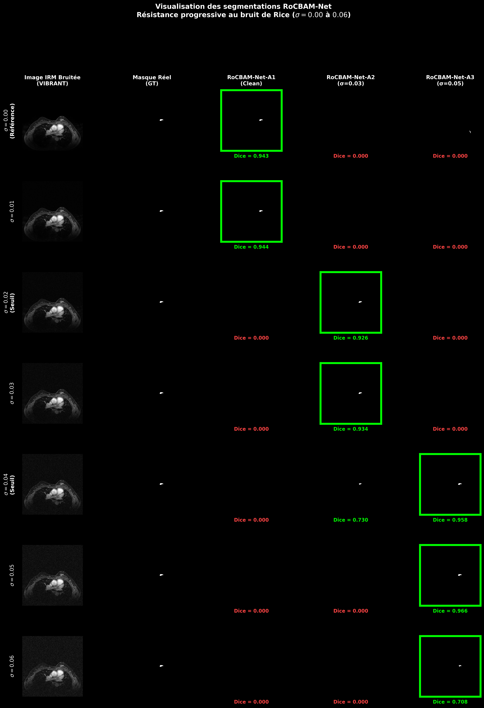
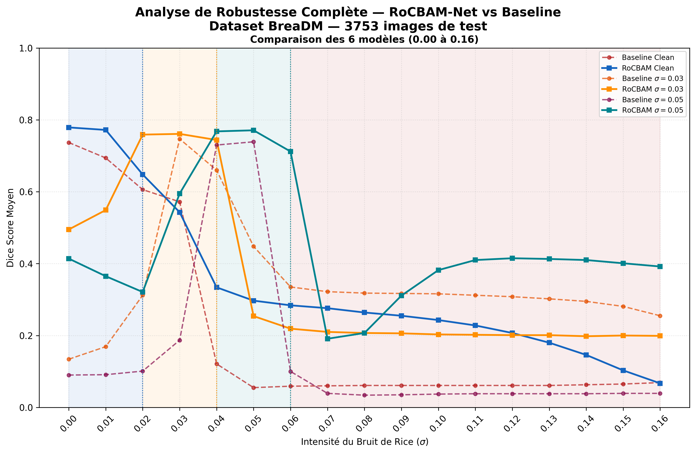
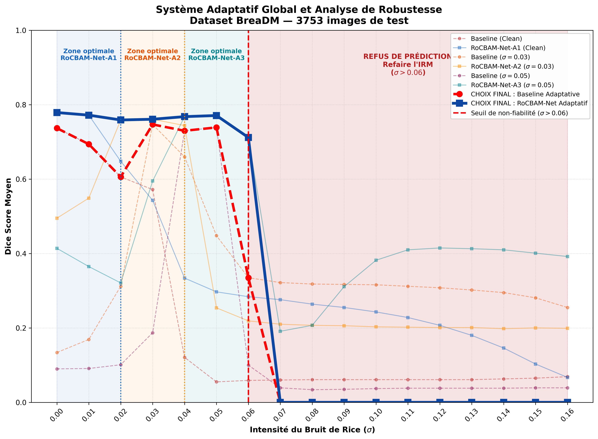

# RoCBAM-Net: 2D Breast Tumor Segmentation in DCE-MRI Under Rician Noise Corruption

[](https://pytorch.org/)
[]()
[](https://opensource.org/licenses/MIT)

## 📌 Overview

**RoCBAM-Net** is an attention-guided deep learning framework engineered for precise **2D breast tumor segmentation in Dynamic Contrast-Enhanced Magnetic Resonance Imaging (DCE-MRI)** scans under varying levels of **Rician noise corruption**.

Involuntary patient movement and hardware instability during extended DCE-MRI protocols introduce severe Rician noise, degrading spatial resolution and causing baseline models to fail. RoCBAM-Net integrates a **Convolutional Block Attention Module (CBAM)** into a 2D U-Net backbone to capture spatial and temporal kinetic features across multi-phase MRI sequences while actively filtering noise artifacts.

---

## 📊 Dataset & Preprocessing

Experiments were conducted on the public **BreastDM** benchmark dataset (VIBRANT sequence protocol):

* **Temporal Kinetics:** Each scan consists of **9 dynamic temporal phases** resized to a spatial resolution of **256×256 pixels** to capture contrast agent wash-in/wash-out kinetics.
* **Stratified Split:** 
  * **Train:** 10,818 images
  * **Validation:** 1,053 images
  * **Test:** 3,753 images
* **Preprocessing & Augmentation:** Intensity normalization to $[0, 1]$, along with geometric data augmentations (random horizontal flips and constrained random rotations strictly limited to $\pm 15^\circ$) to preserve anatomical plausibility.

---

## 🧪 Evaluation Scenarios & Noise Regimes

To evaluate signal degradation resilience, three distinct Rician noise scenarios were defined:

1. **Reference Scenario ($\sigma = 0.00$):** Training and evaluation on clean MRI slices.
2. **Intermediate Vulnerability ($\sigma = 0.03$):** Transition regime where lesion boundaries begin blending into signal fluctuations.
3. **Extreme Robustness ($\sigma = 0.05$):** Severe noise simulating poor acquisition conditions or motion artifacts.

---

## ⚖️ Baseline Adaptation & Comparative Setup

To establish a fair and rigorous comparative baseline, the **RobU-Net** architecture (originally proposed for brain tumor segmentation on different medical imaging datasets) was adapted and re-evaluated under identical experimental constraints:

* **Fair Comparison Protocol:** RobU-Net was trained from scratch on the BreastDM dataset across all three noise regimes ($\sigma = 0.00, 0.03, 0.05$).
* **Identical Hyperparameters:** Both RobU-Net and RoCBAM-Net shared the exact same hybrid loss function ($\mathcal{L}_{\text{wBCE}} + \mathcal{L}_{\text{Dice}}$ with $\omega=50.0$), Adam optimizer settings ($\eta_0 = 10^{-3}$), learning rate scheduling, and early stopping criteria.
* **Controlled Isolation:** Keeping dataset splits, augmentations, and training pipelines constant ensured that all observed performance gains directly isolate the efficacy of RoCBAM-Net's **CBAM spatio-channel attention mechanism**.

---

## 📐 Hybrid Loss Formulation

Due to severe foreground-background class imbalance in the BreastDM dataset, optimization is driven by a hybrid loss combining **Weighted Binary Cross-Entropy ($\mathcal{L}_{\text{wBCE}}$)** and **Dice Loss ($\mathcal{L}_{\text{Dice}}$)**:

$$\mathcal{L}_{\text{total}} = \mathcal{L}_{\text{wBCE}} + \mathcal{L}_{\text{Dice}}$$

### Weighted Binary Cross-Entropy Loss ($\mathcal{L}_{\text{wBCE}}$)
Introduces a penalty factor $\omega = 50.0$ to heavily penalize false negatives and force the detection of isolated tumor pixels:

$$\mathcal{L}_{\text{wBCE}} = -\frac{1}{N} \sum_{i=1}^{N} \left[ \omega \cdot t_i \log(p_i) + (1 - t_i) \log(1 - p_i) \right]$$

### Dice Loss ($\mathcal{L}_{\text{Dice}}$)
Enforces global spatial overlap and contour regularity with a smoothing factor $\epsilon = 10^{-6}$:

$$\mathcal{L}_{\text{Dice}} = 1 - \frac{2 \sum_{i=1}^{N} p_i t_i + \epsilon}{\sum_{i=1}^{N} p_i + \sum_{i=1}^{N} t_i + \epsilon}$$

Where $p_i \in [0, 1]$ represents the predicted probability, $t_i \in \{0, 1\}$ is the ground truth target, and $N$ is the total pixel count.

---

## 📈 Experimental Dynamics Summary

| Architecture | Noise Regime | Init. Dice (Train/Val) | Best Epoch | Train Dice | Val Dice | Status |
| :--- | :--- | :--- | :--- | :--- | :--- | :--- |
| **RobU-Net** | $\sigma = 0.00$ | 0.530 / 0.640 | Epoch 22 | 0.864 | 0.756 | Stopped (Epoch 30) |
| **RoCBAM-Net** | $\sigma = 0.00$ | 0.528 / 0.662 | **Epoch 19** | 0.842 | **0.785** | Stopped (Epoch 29) |
| **RobU-Net** | $\sigma = 0.03$ | 0.539 / 0.659 | Epoch 24 | 0.841 | 0.761 | Stopped (Epoch 32) |
| **RoCBAM-Net** | $\sigma = 0.03$ | 0.518 / 0.674 | **Epoch 25** | 0.840 | **0.765** | Stopped (Epoch 35) |
| **RobU-Net** | $\sigma = 0.05$ | 0.539 / 0.651 | Epoch 11 | 0.766 | 0.742 | Stopped (Epoch 19) |
| **RoCBAM-Net** | $\sigma = 0.05$ | 0.545 / 0.632 | **Epoch 25** | 0.867 | **0.767** | Stopped (Epoch 33) |

---

## 🖼️ Qualitative Segmentation Results

The visualization below illustrates the progressive noise resistance of the RoCBAM-Net variants across increasing levels of Rician noise corruption ($\sigma = 0.00$ to $\sigma = 0.06$):

<p align="center">
  
</p>

### Key Observations:
* **RoCBAM-Net-A1 (Clean):** Delivers optimal segmentation performance on baseline MRI slices ($\sigma \le 0.01$, Dice $\approx 0.944$).
* **RoCBAM-Net-A2 ($\sigma = 0.03$):** Takes over at moderate noise levels ($\sigma = 0.02 - 0.03$), maintaining high dice scores ($\approx 0.934$) where baseline models collapse.
* **RoCBAM-Net-A3 ($\sigma = 0.05$):** Demonstrates extreme noise invariance under severe degradation ($\sigma = 0.04 - 0.06$), maintaining high precision (Dice $\ge 0.958$).

---

## 🛡️ Robustness Analysis & Adaptive Clinical Strategy

### Clinical Stress-Testing Across Noise Regimes ($\sigma \in [0.00, 0.06]$)

Evaluating performance across 3,753 test images reveals distinct operational limits for models trained on varying noise distributions:

| Test Noise ($\sigma$) | RobU-Net (Clean) | RoCBAM-Net (Clean) | RobU-Net ($\sigma=0.03$) | RoCBAM-Net ($\sigma=0.03$) | RobU-Net ($\sigma=0.05$) | RoCBAM-Net ($\sigma=0.05$) |
| :---: | :---: | :---: | :---: | :---: | :---: | :---: |
| **0.00** | 0.737 | **0.779** | 0.495 | 0.761 | 0.414 | 0.712 |
| **0.01** | 0.694 | **0.772** | 0.549 | 0.768 | 0.365 | 0.730 |
| **0.02** | 0.606 | 0.648 | **0.759** | **0.759** | 0.322 | 0.739 |
| **0.03** | 0.572 | 0.543 | 0.744 | **0.765** | 0.595 | 0.768 |
| **0.04** | 0.121 | 0.334 | 0.254 | 0.730 | 0.768 | **0.771** |
| **0.05** | 0.055 | 0.297 | 0.090 | 0.254 | 0.739 | **0.768** |
| **0.06** | 0.059 | 0.284 | 0.091 | 0.219 | 0.335 | **0.712** |

<p align="center">
  
</p>

#### Core Insights:
1. **Clean-Model Degradation:** Clean-trained models experience structural degradation beyond $\sigma = 0.02$, collapsing near $\sigma = 0.04$.
2. **High-Noise Generalization:** Models trained under severe noise ($\sigma = 0.05$) preserve clinical utility ($\text{Dice} > 0.70$) across an extended spectrum ($\sigma \in [0.04, 0.06]$).
3. **Architectural Resilience:** At extreme degradation ($\sigma = 0.04$), clean RobU-Net drops to $0.121$, whereas RoCBAM-Net ($\sigma = 0.05$) retains $0.768$ Dice.

---

### Dynamic Multi-Model Routing & Clinical Safety Guardrail

No single model maintains optimal spatial accuracy across all acquisition qualities. An automated routing system dynamically switches inference modules based on an estimated noise parameter $\sigma_{\text{est}}$:

<p align="center">
  
</p>

* **RoCBAM-Net-A1 ($\sigma \in [0.00, 0.02[$):** Preserves high-frequency vascular boundaries on standard scans ($\text{Dice} \approx 0.78$).
* **RoCBAM-Net-A2 ($\sigma \in [0.02, 0.04[$):** Handles moderate motion and acquisition artifacts.
* **RoCBAM-Net-A3 ($\sigma \in [0.04, 0.06]$):** Maintains spatial consistency ($\text{Dice} > 0.71$) under severe degradation.

#### Fail-Safe Protocol ($\sigma > 0.06$)
Beyond $\sigma = 0.06$, spatial coherence degrades. To prevent false-positive structural hallucinations, the system triggers a **fail-safe response**—outputting empty prediction masks and flagging the DICOM series for re-acquisition.

---

## 📂 Repository Structure

```text
.
├── assets/
│   ├── visualisation_patient_ideal.jpg
│   ├── 1.jpg              # Robustness evaluation chart
│   └── 2.jpg              # Composite envelope & adaptive system chart
├── notebooks/
│   ├── 01_RoCBAMNet_Clean_Sigma00.ipynb
│   ├── 02_RoCBAMNet_Rician_Sigma03.ipynb
│   └── 03_RoCBAMNet_Rician_Sigma05.ipynb
├── models/
│   ├── roc_bam_net.py     # RoCBAM-Net architecture & CBAM attention modules
│   └── losses.py          # WeightedBCEDiceLoss (w=50, eps=1e-6) & get_dice metric
├── utils/
│   └── dataset.py         # PyTorch Dataset for BreastDM 9-phase 256x256 images
├── train.py               # Main training script with ReduceLROnPlateau & Early Stopping
├── evaluate.py            # Evaluation script for Test Dice computation
├── requirements.txt       # Project dependencies
├── .gitignore             # Excludes large binaries (.pth, data)
└── README.md              # Project documentation
